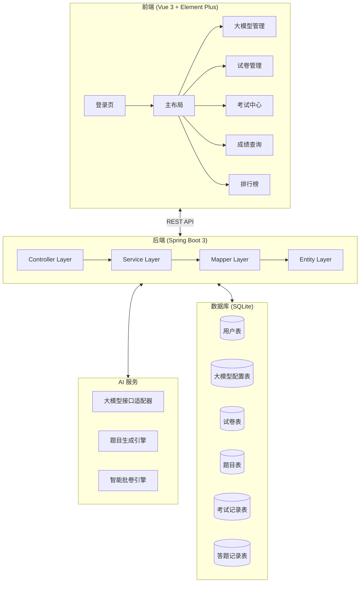
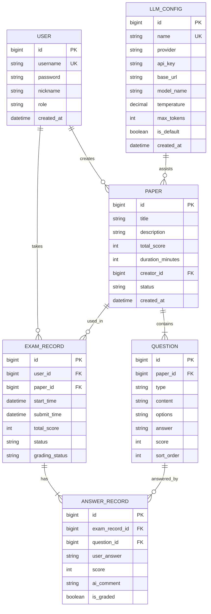

# AI 智能考试系统 - 项目设计文档

## 1. 系统架构



## 2. ER 图



## 3. 接口清单

### 3.1 认证模块 (AuthController)
| Method | Path | Description |
|--------|------|-------------|
| POST | /api/auth/login | 用户登录 |
| POST | /api/auth/register | 用户注册 |
| GET | /api/auth/info | 获取当前用户信息 |

### 3.2 大模型管理 (LlmConfigController)
| Method | Path | Description |
|--------|------|-------------|
| GET | /api/llm/list | 获取所有大模型配置 |
| POST | /api/llm/save | 新增/更新配置 |
| DELETE | /api/llm/{id} | 删除配置 |
| POST | /api/llm/test | 测试连接 |
| PUT | /api/llm/{id}/default | 设为默认 |

### 3.3 试卷管理 (PaperController)
| Method | Path | Description |
|--------|------|-------------|
| GET | /api/paper/list | 获取试卷列表 |
| GET | /api/paper/{id} | 获取试卷详情 |
| POST | /api/paper/save | 保存试卷 |
| DELETE | /api/paper/{id} | 删除试卷 |
| PUT | /api/paper/{id}/publish | 发布试卷 |
| POST | /api/paper/ai-generate | AI 辅助生成题目 |

### 3.4 考试模块 (ExamController)
| Method | Path | Description |
|--------|------|-------------|
| GET | /api/exam/available | 获取可参加的考试 |
| POST | /api/exam/start/{paperId} | 开始考试 |
| GET | /api/exam/record/{id} | 获取考试记录 |
| POST | /api/exam/submit | 提交答卷 |

### 3.5 批卷模块 (GradingController)
| Method | Path | Description |
|--------|------|-------------|
| GET | /api/grading/pending | 待批改列表 |
| POST | /api/grading/ai-grade/{recordId} | AI 自动批卷 |
| POST | /api/grading/manual | 手动批改 |

### 3.6 成绩与排行榜 (ScoreController)
| Method | Path | Description |
|--------|------|-------------|
| GET | /api/score/my | 我的成绩列表 |
| GET | /api/score/detail/{recordId} | 成绩详情 |
| GET | /api/score/ranking/{paperId} | 试卷排行榜 |

## 4. UI/UX 规范

### 4.1 色彩系统
```scss
// 主色调
$primary-color: #409EFF;
$primary-light: #ECF5FF;
$primary-dark: #337ECC;

// 功能色
$success-color: #67C23A;
$warning-color: #E6A23C;
$danger-color: #F56C6C;
$info-color: #909399;

// 中性色
$text-primary: #303133;
$text-regular: #606266;
$text-secondary: #909399;
$text-placeholder: #C0C4CC;

// 背景色
$bg-page: #F5F7FA;
$bg-card: #FFFFFF;
$border-color: #EBEEF5;
```

### 4.2 间距系统
- 基础单位: 8px
- 常用间距: 8px / 16px / 24px / 32px

### 4.3 圆角规范
- 小圆角 (按钮、输入框): 4px
- 中圆角 (卡片): 8px
- 大圆角 (弹窗): 12px

### 4.4 阴影规范
```scss
$shadow-sm: 0 2px 4px rgba(0, 0, 0, 0.08);
$shadow-md: 0 4px 12px rgba(0, 0, 0, 0.1);
$shadow-lg: 0 8px 24px rgba(0, 0, 0, 0.12);
```

### 4.5 字体规范
- 标题: 20px / 18px / 16px (font-weight: 600)
- 正文: 14px (font-weight: 400)
- 辅助文字: 12px (font-weight: 400)
